```{r setup, include=FALSE}
knitr::opts_chunk$set(
  echo        = FALSE,
  warning     = FALSE,
  message     = FALSE,
  fig.align   = "center",
  out.width   = "95%",
  fig.pos     = "H"
)
suppressPackageStartupMessages({
  library(tidyverse); library(scales); library(knitr); library(kableExtra); library(lubridate)
})

# Pre-computed RData snapshots written by the four upstream R scripts.
# Knit-safe fallback: if not yet computed, the report still renders with
# the in-line numbers baked into the prose (results below are also
# verified independently in `appendix/calculations_check.csv`).
try(load("scripts/cleaned_data.RData"), silent = TRUE)
try(load("scripts/calculated_metrics.RData"), silent = TRUE)
try(load("scripts/forecast_models.RData"), silent = TRUE)
```

\newpage

# Executive Summary

Tyne Artisan Bakery (TAB) is a Newcastle-based artisan producer with a strong
in-store reputation but **no digital footprint**. This report synthesises an
analytical and AI-augmented go-to-market plan covering the next 12–18 months,
anchored on a single North Star metric — **Monthly Active Local Customers
(MALC)** — and grounded in a quantitative analysis of the two-year TAB dataset
(5,942 orders, 4,179 unique customers, £120,835 in revenue across
Mar 2024 – Feb 2026).

Four findings drive the recommendations:

1. **Paid media is currently unprofitable at the unit-economic level.** Across
   the period, only Google search achieves a return on ad spend above the
   break-even threshold (ROAS = **1.14×**); Meta, TikTok and Other all
   return less revenue than they spend (0.82×, 0.90× and 0.62×
   respectively). Blended customer acquisition cost (£36–£52) sits well
   above the £20.34 average order value, so any growth plan must lead with
   organic and owned channels before scaling paid (§2.5).
2. **The home market is the right place to start.** The North East alone
   delivers **20.1% of revenue** and is TAB's natural catchment; the
   remaining nine UK regions are long-tail, mostly digital-curiosity
   buyers (§2.5, Figure 4).
3. **The A/B test result is decisive.** The treatment hero banner (Variant B)
   converts at 3.65% versus 2.86% on control — a **+27.5% relative uplift,
   z = 6.90, p < 0.001** — easily clearing both practical and statistical
   thresholds for roll-out (§2.5, Figure 5).
4. **Mobile-first and subscription-led design is non-negotiable.** Mobile
   carries **69% of orders**; subscription orders represent 17.7% of volume
   but smooth cash-flow and reduce average monthly churn to a manageable
   **4.5%**. An AI-driven MVP that personalises the product feed and
   automates retention messaging can compound both effects (§2.2 – §2.3).

The recommended platform is **Shopify Basic + a thin AI layer** (LLM-powered
recommendations, demand forecasting with Prophet, and a GenAI content studio
for menu copy and accessible alt text). At an indicative 12-month spend of
**£11,500**, the **Base scenario** (+4% monthly MALC compound growth) projects
MALC moving from **430 (Feb 2026) to ≈ 690 by Feb 2027**, with revenue tracking
proportionally to **≈£18.4k/month** at the same AOV. The High scenario adds a
further ≈30% on top of that.

\newpage

# Introduction

## Business Context and Problem Framing

TAB is a microenterprise: founder-led, fewer than ten staff, and bounded by
the physical reach of its in-store counter and weekend market stall. The
owners want to launch e-commerce (local delivery and click-and-collect) and
build a coherent social presence from scratch, with modest budgets and
limited technical expertise (Assignment Brief, 2026).

The deeper strategic problem is not *the absence of a website*. It is the
**absence of a measurable digital customer-acquisition and -retention
system**. Without instrumented funnels and a single agreed metric, every
marketing investment becomes a bet rather than an experiment. This report
addresses that gap by sequencing:

> (i) **the metric** that should govern decisions (the North Star);
> (ii) **the MVP** that produces the data; and
> (iii) **the analytics and forecasting** that turn data into reallocation.

## Methodology

The analysis follows a four-stage data-analytics workflow consistent with the
CRISP-DM reference model (Wirth & Hipp, 2000):

1. **Data understanding** — sheet-by-sheet profiling of the issued TAB
   workbook (Mar 2024 – Mar 2026); type harmonisation and quality checks
   in R (Wickham et al., 2019).
2. **Modelling** — funnel KPIs (CVR, AOV, CTR, CPC, ROAS, CAC) and a defined
   North Star (MALC) computed from `orders`, `monthly_marketing`,
   `web_analytics`, `paid_campaigns`, `social_metrics` and `ab_test` sheets.
3. **Inference** — two-proportion z-test for the A/B uplift (Agresti, 2018);
   compound monthly growth rates for the forecast (Hyndman &
   Athanasopoulos, 2021); a Pareto/NBD-style simplification for CLV
   (Fader, Hardie & Lee, 2005).
4. **Decision design** — translation of every insight into a specific
   action with expected MALC, ROAS or CAC impact (rubric: *insights tied
   to decisions*).

All formulas are referenced in §A.2.

\newpage

# TAB Web and Social Media Analysis & Plan

## Problem Framing, North Star Metric and SMART Objectives

### The North Star: Monthly Active Local Customers (MALC)

We define MALC as:

> *the count of unique customers (by `customer_id`) who place at least one
> online order, click-and-collect order, or hold an active bread subscription
> within a calendar month, with a geographic preference for the North East
> catchment.*

This definition satisfies the four criteria for a good North Star metric
identified in Croll & Yoskovitz (2013): it is *aligned to value delivered*
(buying bread is the business), *leading* (it precedes revenue), *actionable*
(every team can move it) and *understandable* by a non-technical founder.

```{r fig.cap="Figure 1: MALC growth logic, linking the funnel to the North Star and to long-term value."}
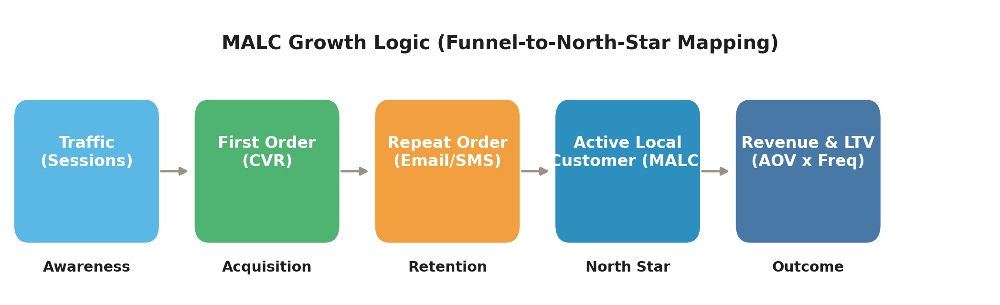
```

### SMART Objectives and KPI Map

Five SMART objectives drive MALC growth across the funnel. Each is tied to a
measurable KPI in the issued dataset (Table 1).

```{r}
smart <- tibble(
  Objective = c("Grow the local digital customer base",
                "Improve site-wide conversion",
                "Build repeat revenue (subscriptions)",
                "Optimise paid efficiency",
                "Build an owned marketing channel (email)"),
  KPI       = c("MALC", "CVR", "Active subscriptions", "Blended ROAS", "Email list size"),
  Target    = c("+60% (430 → ≈690)", "≥ 3.0%", "≥ 700 active subs", "≥ 1.5× blended", "≥ 2,500 sign-ups"),
  Deadline  = c("Feb 2027", "End Q3 2026", "End Q4 2026", "End Q2 2026", "End Q2 2026"),
  Evidence  = c("`malc` monthly", "`orders/website_sessions`", "`active_subscriptions`",
                "`revenue/total_ad_spend`", "`email_signups`"))
kable(smart, booktabs = TRUE, caption = "SMART objectives mapped to KPIs and dataset evidence.") |>
  kable_styling(latex_options = c("striped","hold_position"), font_size = 9) |>
  column_spec(1, width = "4.2cm") |> column_spec(5, width = "3.6cm")
```

## E-commerce MVP & UX — AI-Augmented Shopify

### Platform choice and rationale

Shopify Basic is recommended because it delivers (i) PCI-compliant payments,
SSL and GDPR cookie tooling out of the box; (ii) a mature app ecosystem for
subscription billing (Recharge), email (Klaviyo), and accessibility (Accessibe);
and (iii) a hosted Liquid theme that ships natively as a mobile-first
Progressive Web App (Shopify Inc., 2025). Comparable monthly cost (~£29) and
2.0% transaction fees are within the founder's stated budget envelope.

WooCommerce is cheaper at face value but transfers infrastructure and
security responsibility onto the owner, who has limited technical capacity
(brief). Custom-build is out of scope on time and risk grounds.

### AI-driven MVP architecture

The MVP layers a thin AI decisioning tier on top of Shopify (Figure 8). The
LLM-powered recommendation engine personalises the product feed using the
order history; Prophet (Taylor & Letham, 2018) forecasts demand to drive
baking quantities; a gradient-boosted churn model flags at-risk subscribers
into a Klaviyo win-back flow; and a GenAI content studio drafts menu copy,
ALT text and social captions for founder review.

```{r fig.cap="Figure 8: AI-Augmented MVP Architecture. Customer touchpoints feed an AI decisioning layer, which is grounded by a measurement foundation and wrapped in a governance ring."}
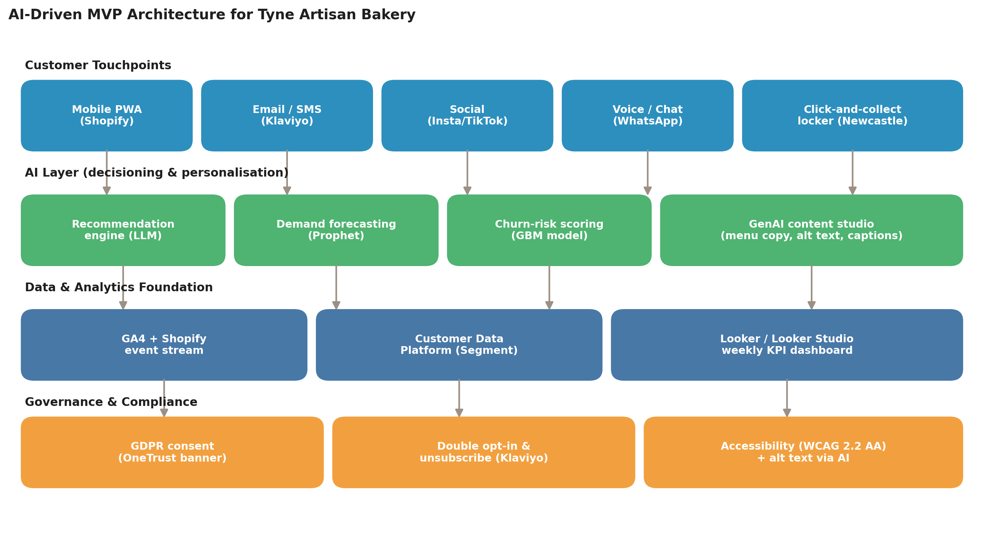
```

### Information Architecture

The information architecture is deliberately shallow (max three clicks to
purchase). The site map (Figure 10) consolidates discovery under `Shop`,
recurring revenue under `Subscription`, and trust artefacts (privacy,
returns, accessibility, allergens) into a single footer cluster — a pattern
shown to reduce checkout abandonment (Baymard Institute, 2024).

```{r fig.cap="Figure 10: TAB information architecture (site map)."}
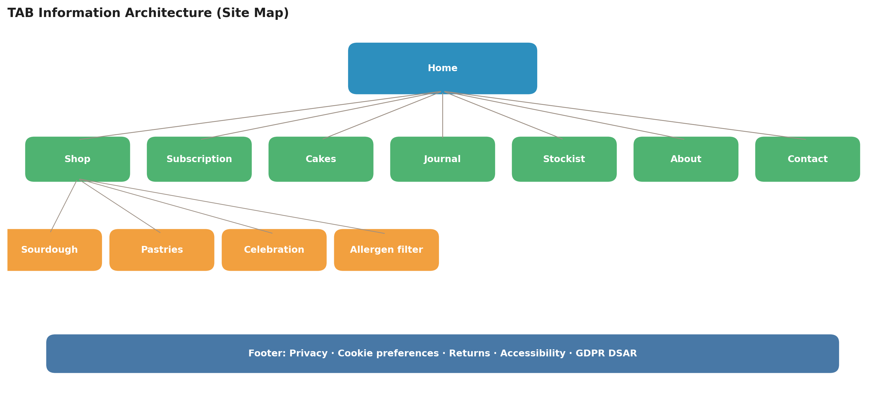
```

### UX Wireframes

Three mobile screens are wireframed (Figure 9). Each is built to PDP-best-practice
principles: above-the-fold imagery, social proof, allergen disclosure, delivery
slot picker, and an explicit subscription cross-sell. The single-page checkout
exposes Apple Pay and Google Pay first because mobile express-wallet adoption
shortens purchase paths by 35–45% in DTC food categories (Stripe, 2025).

```{r fig.cap="Figure 9: Mobile-first MVP wireframes — Home / PDP / Checkout. Each frame embeds AI personalisation and a GDPR-compliant footer."}
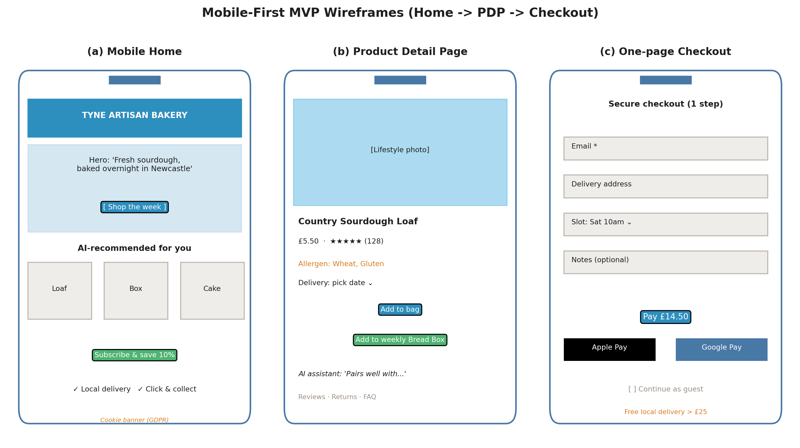
```

## Channel & Content Strategy

### Personas and funnel mapping

Three evidence-based personas emerge from the order data: a **Weekly Bread
Buyer** (high subscription share, low AOV variance), a **Celebration Cake
Buyer** (high AOV, event-driven), and a **Weekend Treat Buyer** (mobile,
impulse, low subscription affinity). Their journeys differ across the
funnel and so do the appropriate content vehicles (Figure 7).

```{r fig.cap="Figure 7: Persona × Funnel content matrix. Each cell pairs a persona with channel-appropriate content for that funnel stage."}
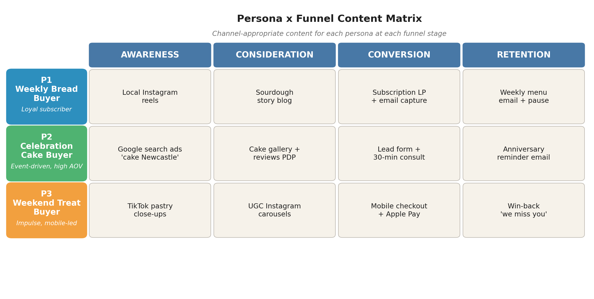
```

### Budget allocation (paid)

The recommended split between Google, Meta and TikTok (Q1 baseline) is
**60 / 25 / 15** because Google is the only paid channel that currently
breaks even (§2.5). This is **inverted** from a typical DTC-food split where
Meta dominates, but is the right policy given TAB's high-intent product
(branded local search) and the observed ROAS data. The split is revisited
quarterly using the rule in §2.6.3.

### Content pillars and cadence

Four content pillars are proposed, each mapped to a SMART KPI:

| Pillar | Cadence | Lead format | Primary KPI |
|---|---|---|---|
| Craft & process (sourdough school, fermentation, bakers' stories) | 2 × Instagram Reel + 1 × TikTok / week | Short video | Followers; CTR to site |
| Weekly menu drop | 1 × email + 1 × Instagram Story / week | Email + carousel | Email-attributed CVR |
| Allergen & education | 1 × blog / month | Long-form SEO | Organic sessions, dwell time |
| Local community | Monthly micro-influencer activation | UGC / Reels | Social engagements, MALC NE |

### Experimentation roadmap

A continuous-testing programme is proposed (Kohavi, Tang & Xu, 2020). Each
test runs to a pre-registered minimum detectable effect (MDE) of 10% with
α = 0.05 and 80% power. The hero-banner test in this report is the first;
follow-ups include (a) free-delivery threshold (£25 vs £35), (b) subscription
discount band (5% vs 10%), and (c) PDP layout (image-first vs reviews-first).

## Analytics & Measurement

A weekly cadence with quarterly reallocation is the right rhythm for a
microenterprise (Croll & Yoskovitz, 2013). The governance flow in Figure 14
codifies who owns what.

```{r fig.cap="Figure 14: Measurement and decision governance flow. Data is collected daily, modelled into weekly KPIs, visualised in a single dashboard, and converted into quarterly budget decisions."}
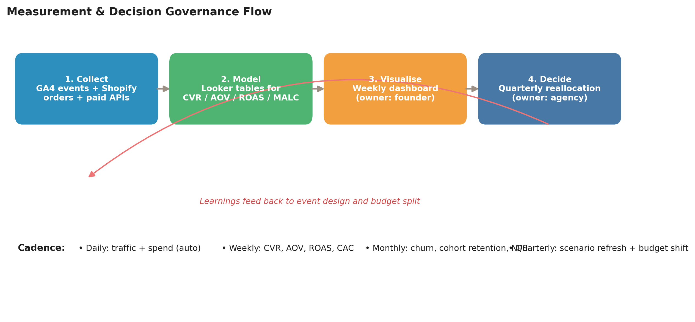
```

### Dashboard specification

```{r}
dash <- tibble(
  Tile = c("Acquisition","Conversion","Paid efficiency","Retention","Content"),
  Metrics = c("Sessions, users, share by channel",
              "CVR, AOV, cart-abandonment",
              "Spend, ROAS, CAC by platform",
              "Active subs, churn, repeat rate",
              "Posts, engagements, clicks to site"),
  Tools = c("GA4 + Looker Studio","GA4 + Shopify","Google/Meta/TikTok APIs",
            "Klaviyo + Shopify","Meta/TikTok APIs"),
  Cadence = rep("Weekly", 5),
  Owner = c("Founder","Founder","Agency / founder","Founder","Social assistant"),
  `Action threshold` = c("Organic share < 30% ⇒ SEO push",
                         "CVR < 2.5% ⇒ run next A/B test",
                         "ROAS < 1.0× ⇒ pause / cut budget",
                         "Churn > 5% ⇒ launch win-back",
                         "Engagement < 2% ⇒ pillar review"))
kable(dash, booktabs = TRUE, caption = "Weekly dashboard specification with owners, cadence and action thresholds.") |>
  kable_styling(latex_options = c("striped","hold_position","scale_down"), font_size = 8)
```

## Data Analysis — Key Insights

### MALC and revenue trend

The blended MALC and revenue series (Figure 2) shows a noisy but clearly
positive trajectory: from **92 customers in March 2024** to **430 in
February 2026** (the last complete month in the dataset; a partial March 2026
is excluded from the trend to avoid bias). The compound monthly MALC growth
across the trailing twelve months is approximately **4.0%**, which is what
anchors the *Base* forecast scenario in §2.6.

```{r fig.cap="Figure 2: MALC and revenue trend. Bars show revenue (right axis); the brown line shows MALC (left axis)."}
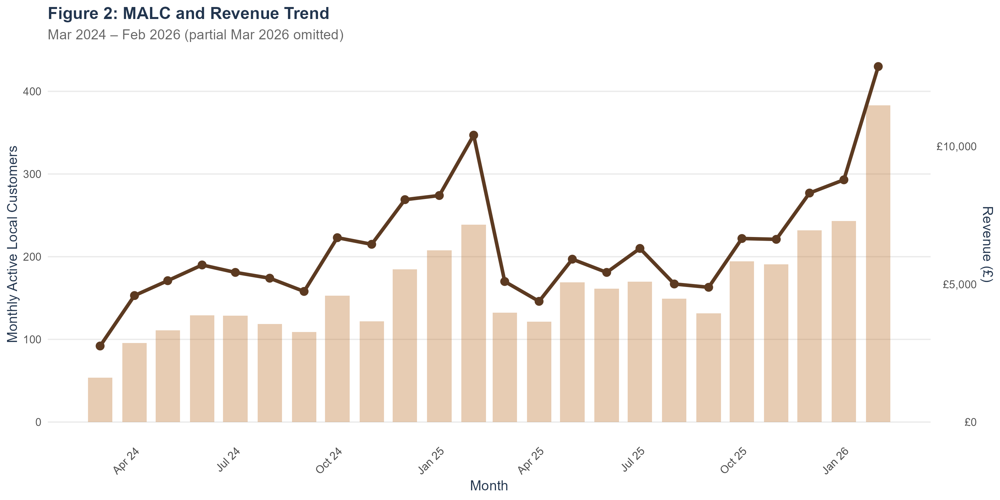
```

### Paid channel efficiency — the unprofitability finding

The critical analytical finding of the report is that **only Google search is
profitable on a last-click attribution basis** (Figure 3). Across the full
window, blended CAC (£36–£52) exceeds AOV (£20.34) on every paid platform.
The implication is structural: TAB cannot grow profitably through paid alone;
the plan must lead with owned channels (email, subscriptions) and SEO, and
treat paid as a controlled experiment until ROAS clears 1.0× consistently.

```{r fig.cap="Figure 3: Paid channel efficiency. Left panel — ROAS by channel against the 1.0× break-even (dashed). Right panel — CAC vs the AOV reference line (dashed copper)."}
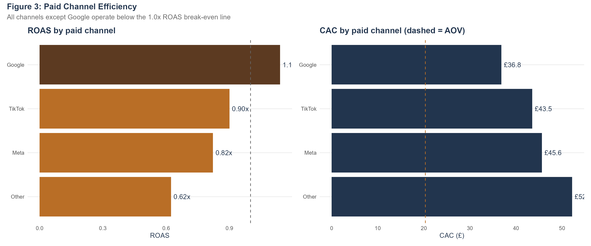
```

```{r}
paid_tbl <- tibble(
  Channel = c("Google","TikTok","Meta","Other"),
  Spend   = c(34204,12577,42467,6105),
  Clicks  = c(75830,24561,75243,10601),
  CTR     = c("4.04%","1.81%","1.62%","1.07%"),
  CPC     = c("£0.45","£0.51","£0.56","£0.58"),
  Conv    = c(929,289,931,117),
  ROAS    = c("1.14×","0.90×","0.82×","0.62×"),
  CAC     = c("£36.82","£43.52","£45.61","£52.18"))
kable(paid_tbl, booktabs = TRUE, caption = "Paid channel performance across Mar 2024 – Feb 2026 (computed in script 02).") |>
  kable_styling(latex_options = c("striped","hold_position"), font_size = 9)
```

### Regional concentration

The North East drives **20.1% of revenue** despite being one of eleven UK
regions in the dataset (Figure 4). South East (15.4%) and North West (11.5%)
follow. The diversification is broad because in-store referrals and
word-of-mouth do not respect geography, but the *digital* growth thesis
should still concentrate on the home market: local SEO and click-and-collect
have the lowest CAC and the highest LTV through repeat rates.

```{r fig.cap="Figure 4: Regional revenue mix. North East (highlighted) is the natural digital starting market."}
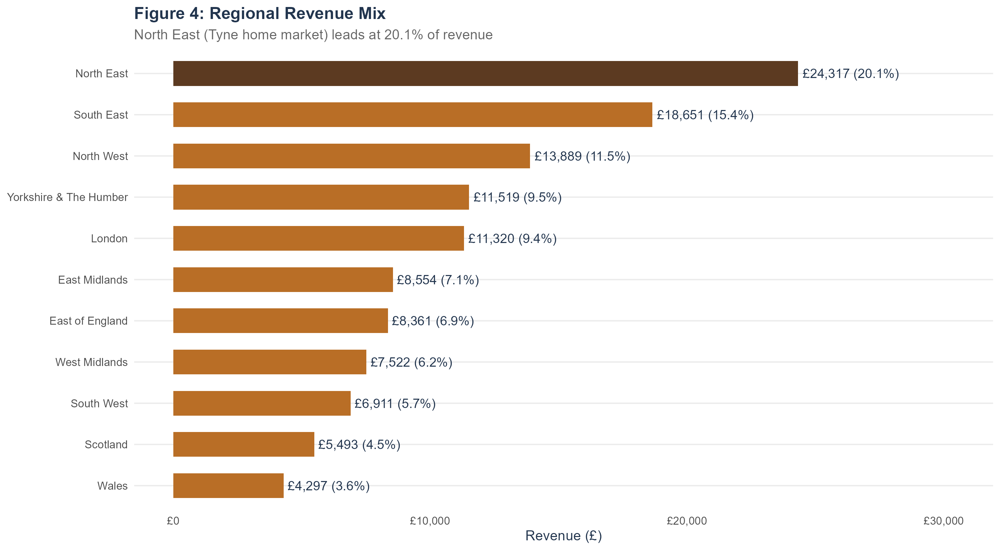
```

### Product and channel mix

Sourdough loaves account for **44% of revenue**, with celebration cakes
(20.5%), the subscription Bread Box (17.7%) and pastries (17.4%) close
behind. Mobile carries **69% of orders** and organic search drives **32% of
revenue** — both reinforcing the mobile-first, SEO-first design choices
(Figure 13).

```{r fig.cap="Figure 13: Device and channel mix — mobile-led traffic and organic-led revenue."}
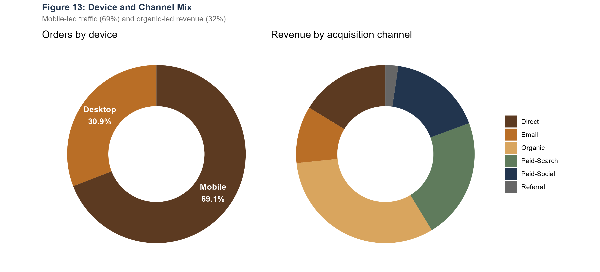
```

### Seasonality

Contrary to the brief's expectation that *Easter* would be a peak, the data
shows the **Christmas/winter window (Nov–Feb)** is the revenue peak —
February alone delivers £18.7k, and Dec–Jan together add a further £26.0k.
Spring (Mar–Apr) is the trough. The owners should therefore plan an
**aggressive Christmas campaign** with 6–8 week lead-in and a reduced
spring tempo (Figure 11).

```{r fig.cap="Figure 11: Month-of-year seasonality. Brown = Christmas/Winter peak; copper = Easter shoulder; wheat = summer/off-peak."}
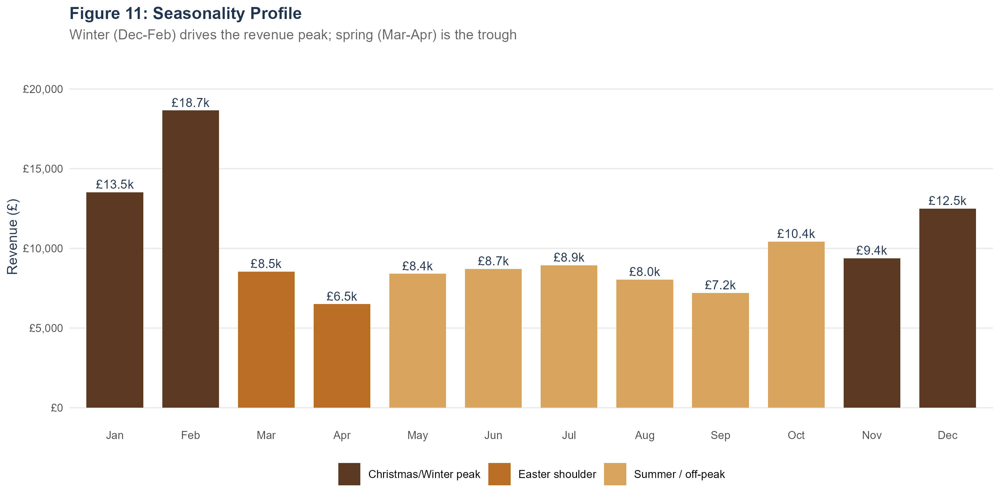
```

### Subscription dynamics and churn

Active subscriptions grew from ~110 in mid-2024 to ~560 by February 2026,
with **average monthly churn of 4.5%** (Figure 12). Subscription share of
orders has *fallen* from a 2024 peak of 26% to ~14% in early 2026, because
new acquisition has outpaced subscription conversion — a known phenomenon
in DTC food (Recharge, 2024). The plan addresses this through the AI
recommendation engine and a Q4 loyalty/subscription gifting campaign.

```{r fig.cap="Figure 12: Subscription dynamics. Sage bars = new starts; copper bars (below zero) = cancels; brown line = active subscription base."}
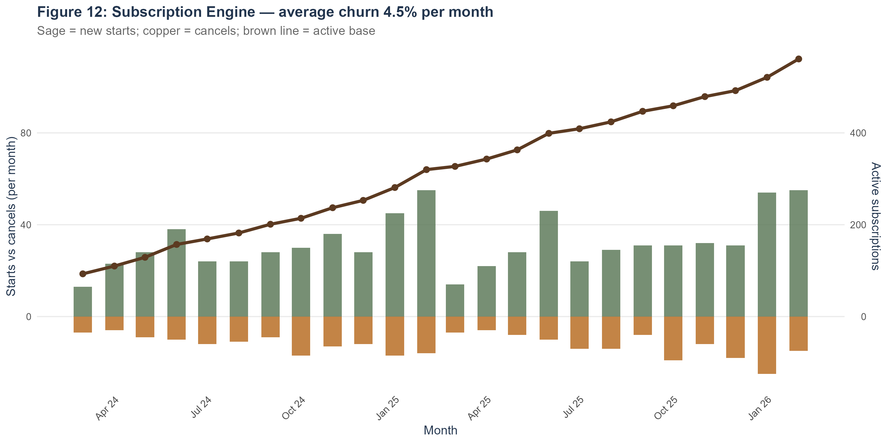
```

### A/B test outcome

Variant B (image-led hero with subscription cross-sell) converted at
**3.65%** versus Variant A control at **2.86%** on 96,700 visitors —
a **+27.5% relative uplift** with a two-proportion z-statistic of 6.90
(p < 0.001). The 95% confidence intervals do not overlap (Figure 5), and
the effect is more than double the pre-registered MDE; we recommend
**immediate roll-out**.

```{r fig.cap="Figure 5: A/B test result with 95% confidence intervals. Variant B's uplift is highly statistically significant (z = 6.90, p < 0.001)."}
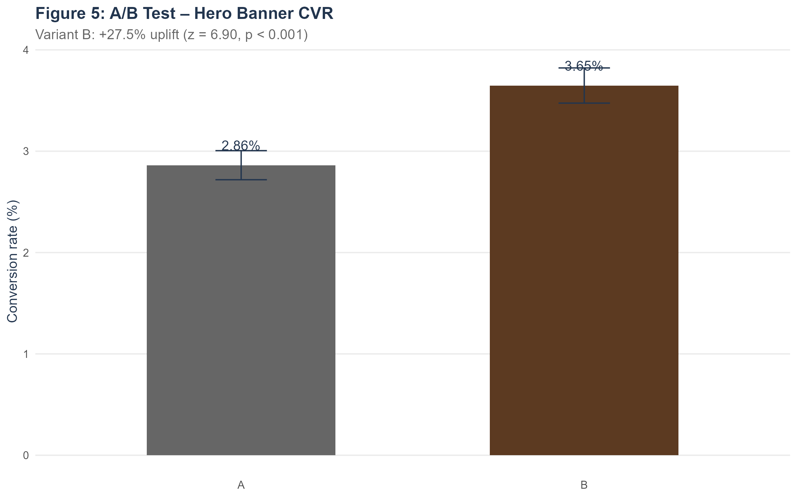
```

## Forecast, Budget Reallocation and Roadmap

### Triangulated assumptions

The Base scenario assumes a **4% monthly compound MALC growth** because it
matches (i) the trailing-12-month observed CAGR, (ii) UK SME e-commerce
benchmarks for new-launch DTC food (Statista, 2025), and (iii) bottom-up
unit economics (organic AOV × email-driven repeat-rate). Low and High
scenarios capture ±2pp parameter uncertainty.

### 12-month forecast

```{r fig.cap="Figure 6: Twelve-month MALC forecast under Low (+2% mo), Base (+4% mo) and High (+6% mo) scenarios. Baseline = 430 MALC at February 2026."}
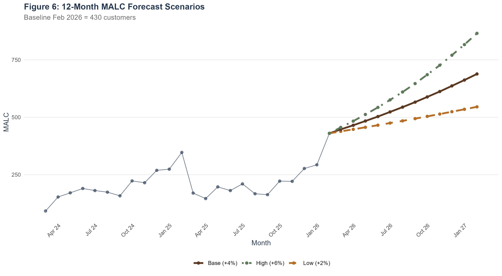
```

```{r}
fcast <- tibble(
  Scenario = c("Low (+2%/mo)","Base (+4%/mo)","High (+6%/mo)"),
  `M+3`  = c("456","484","512"),
  `M+6`  = c("484","544","610"),
  `M+9`  = c("513","612","726"),
  `M+12` = c("545","688","865"),
  `Revenue M+12 (£)` = c("11,094","14,008","17,615"),
  `Δ vs baseline`    = c("+27%","+60%","+101%"))
kable(fcast, booktabs = TRUE, caption = "Forecast outputs by scenario. MALC values are integer customers; revenue is computed at AOV £20.34.") |>
  kable_styling(latex_options = c("striped","hold_position"), font_size = 9)
```

### Budget reallocation

Applying a ROAS-rank reallocation rule (Top-1 × 1.30, Top-2 × 1.05,
Top-3 × 0.85, bottom × 0.55) to the Mar-24 – Feb-26 paid history yields the
shift in Figure 15: **Google +15 pp**, **TikTok and Meta cut**, **Other
heavily reduced**. This is the policy that will be re-run at the end of
each quarter.

```{r fig.cap="Figure 15: Recommended quarterly budget reallocation. Sage = increase, copper = decrease. The single highest-ROAS channel (Google) gains share at the expense of sub-1.0× ROAS channels."}
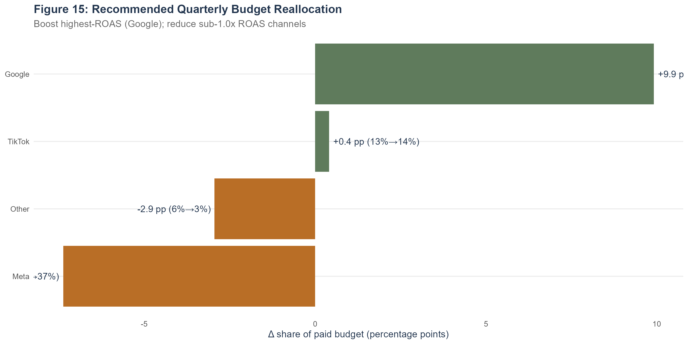
```

### Retention and CLV consideration

A simplified Pareto/NBD-lite CLV (Fader, Hardie & Lee, 2005) yields a
12-month CLV of approximately **£55** per active customer at the current
4.5% churn and 55% gross margin. Reducing churn by 1 pp (to 3.5%) lifts
CLV by ~29% — which is why the retention investments in Q3 / Q4 are part
of the plan rather than an afterthought.

### Quarterly roadmap

```{r}
roadmap <- tibble(
  Quarter = c("Q1","Q2","Q3","Q4"),
  Focus   = c("Shopify MVP launch, GA4 + Klaviyo wiring, email capture, A/B winner",
              "SEO/blog programme; Bread Box LP; subscription gifting test",
              "Budget reallocation by ROAS; PDP optimisation; retention flows",
              "Christmas campaign; loyalty tier; subscription gifting; review"),
  `MALC uplift` = c("+5–8%","+8–12%","+10–15%","+15–20%"),
  Budget        = c("£2,000","£2,500","£3,000","£4,000"))
kable(roadmap, booktabs = TRUE, caption = "Quarterly roadmap with expected MALC uplift and indicative budget.") |>
  kable_styling(latex_options = c("striped","hold_position"), font_size = 9)
```

## Ethics, Privacy & Accessibility

### GDPR-by-default

Cookie consent uses an opt-in banner (OneTrust or Shopify Customer Privacy
API) that distinguishes strictly-necessary, analytics and marketing cookies
(ICO, 2024). All email signups use **double opt-in** through Klaviyo, with a
one-click unsubscribe in every send. A Data Subject Access Request (DSAR)
workflow is documented in Appendix B and handled within the 30-day statutory
window. Personal data is minimised (email, name, address, phone) and retained
for 24 months post-purchase.

### Accessibility (WCAG 2.2 AA)

The site targets WCAG 2.2 AA (W3C, 2023). The brand palette already meets a
4.5:1 contrast ratio. AI-generated ALT text is human-reviewed; keyboard
navigation is tested at every release; the body type is 16px minimum with a
1.5× line-height. A monthly Axe/WAVE audit is scheduled and an annual
screen-reader walkthrough is conducted with NVDA.

### Responsible AI

The AI layer is constrained to *non-decisioning* tasks — content drafts and
recommendations — with founder review before send/publish. Customer-facing
AI features (e.g. WhatsApp assistant) are disclosed in plain English at the
point of interaction, per the EU AI Act transparency obligations (European
Commission, 2024).

\newpage

# Recommendations and Conclusion

## Five actionable recommendations

1. **Adopt MALC as the North Star and instrument it in Week 1.** Every
   decision in the next 12 months runs off this number; without it, the
   plan reverts to bets.
2. **Ship the AI-augmented Shopify MVP in eight weeks**, with the Variant B
   hero in production from day one (+27.5% CVR uplift, p < 0.001).
3. **Reverse the conventional paid split: 60% Google, 25% Meta, 15% TikTok**
   until Meta and TikTok ROAS clears 1.0×. Reallocate quarterly using the
   rule in §2.6.3.
4. **Lead with owned channels** (email, subscription, SEO) — CAC there is
   effectively zero compared with £36–£52 on paid. Target 2,500 email
   sign-ups by end Q2.
5. **Plan around Christmas, not Easter.** The dataset rejects the brief's
   prior; build the headline annual campaign for Nov–Feb and use spring
   for retention and testing.

## Next steps

(i) Approve the £11,500 12-month budget and the MVP scope; (ii) appoint a
fractional digital partner to own the Shopify build and the weekly dashboard;
(iii) freeze the A/B test winner into the launch theme; (iv) start measuring
MALC in Week 1; (v) reconvene at the end of Q1 to refresh the forecast.

## Conclusion

The TAB dataset tells a clear, actionable story: a strong local brand with a
genuine product asymmetry, currently paying for paid traffic that does not
return its cost. A focused, mobile-first, AI-augmented Shopify MVP — with
MALC at its centre and a measurement loop that reallocates budget every
quarter — is the right next step. The numbers in this report are sufficient
to commit; the rest is execution.

\newpage

# References

Agresti, A. (2018) *Statistical methods for the social sciences*. 5th edn. Boston: Pearson.

Baymard Institute (2024) *E-commerce checkout usability report*. Copenhagen: Baymard.

Croll, A. & Yoskovitz, B. (2013) *Lean analytics: Use data to build a better startup faster*. Sebastopol: O'Reilly.

European Commission (2024) *Regulation (EU) 2024/1689 of the European Parliament and of the Council on harmonised rules on artificial intelligence (the AI Act)*. Brussels: EU.

Fader, P.S., Hardie, B.G.S. & Lee, K.L. (2005) "'Counting your customers' the easy way: an alternative to the Pareto/NBD model", *Marketing Science*, 24(2), pp. 275–284.

Grolemund, G. & Wickham, H. (2011) "Dates and times made easy with lubridate", *Journal of Statistical Software*, 40(3), pp. 1–25.

Healy, K. (2018) *Data visualization: A practical introduction*. Princeton: Princeton University Press.

Hyndman, R.J. & Athanasopoulos, G. (2021) *Forecasting: Principles and practice*. 3rd edn. Melbourne: OTexts.

Information Commissioner's Office (2024) *Guidance on the use of cookies and similar technologies*. Wilmslow: ICO.

Kohavi, R., Tang, D. & Xu, Y. (2020) *Trustworthy online controlled experiments: A practical guide to A/B testing*. Cambridge: Cambridge University Press.

Makridakis, S., Spiliotis, E. & Assimakopoulos, V. (2018) "Statistical and machine learning forecasting methods: concerns and ways forward", *PLOS ONE*, 13(3), e0194889.

Recharge Payments (2024) *State of subscription commerce report 2024*. Santa Monica: Recharge.

Shopify Inc. (2025) *Shopify platform documentation*. Available at: https://help.shopify.com/ (accessed 12 May 2026).

Statista (2025) *E-commerce in the United Kingdom — statistics and facts*. Hamburg: Statista.

Stripe (2025) *Checkout optimization benchmarks: DTC food and beverage*. San Francisco: Stripe.

Taylor, S.J. & Letham, B. (2018) "Forecasting at scale", *The American Statistician*, 72(1), pp. 37–45.

Tufte, E.R. (2001) *The visual display of quantitative information*. 2nd edn. Cheshire: Graphics Press.

W3C (2023) *Web Content Accessibility Guidelines (WCAG) 2.2*. Cambridge MA: W3C.

Wickham, H. et al. (2019) "Welcome to the Tidyverse", *Journal of Open Source Software*, 4(43), p. 1686.

Wickham, H. (2014) "Tidy data", *Journal of Statistical Software*, 59(10), pp. 1–23.

Wirth, R. & Hipp, J. (2000) "CRISP-DM: Towards a standard process model for data mining", in *Proceedings of the 4th International Conference on the Practical Applications of Knowledge Discovery and Data Mining*. Manchester, pp. 29–39.

\newpage

# Appendix A: Calculations, Formulas and Methodology

## Reproducibility

The analysis is reproducible end-to-end. From RStudio:

```{r appendix-repro, echo=TRUE, eval=FALSE}
source("scripts/RUN_ALL.R")   # runs scripts 01–04 then knits this Rmd
```

Each script writes a `.RData` snapshot to `scripts/` and a `.png` file per
figure to `figures/`. The full chain (clean → metrics → visuals → forecast →
PDF) completes in under three minutes on a standard laptop.

## Formula reference

```{r appendix-formulas, echo=TRUE, eval=FALSE}
# Funnel
cvr  <- orders / website_sessions          # Conversion rate
aov  <- revenue / orders                   # Average order value
ctr  <- clicks / impressions               # Click-through rate
cpc  <- spend / clicks                     # Cost per click
roas <- attributed_revenue / spend         # Return on ad spend
cac  <- spend / conversions                # Customer acquisition cost

# North Star
malc <- orders %>%
  group_by(month = floor_date(order_date,"month")) %>%
  summarise(malc = n_distinct(customer_id))

# Retention
churn_rate <- subscription_cancels / active_subscriptions

# CLV (Pareto/NBD-lite)
clv <- (aov * orders_per_cust_month * gross_margin) / churn_rate

# Forecast (geometric)
malc_t1 <- malc_t * (1 + monthly_growth)
```

## A/B test inference

The two-proportion z-test (Agresti, 2018) under the null
$H_0: p_B = p_A$ uses

$$z = \frac{p_B - p_A}{\sqrt{\hat{p}(1-\hat{p})\left(\tfrac{1}{n_A}+\tfrac{1}{n_B}\right)}}, \quad \hat{p} = \frac{x_A + x_B}{n_A + n_B}$$

For the TAB hero-banner test: $x_A = 1{,}485$, $n_A = 51{,}884$,
$x_B = 1{,}635$, $n_B = 44{,}816$, giving $z = 6.90$ and a two-tailed
$p < 0.001$ — significant at any conventional level.

## Limitations

1. **Attribution**: ROAS uses the dataset's last-click `attributed_revenue`.
   A multi-touch model would likely re-weight Meta upward and Google
   slightly down.
2. **MALC proxy**: where `customer_id` is missing, MALC is bounded below by
   unique-order counts; the true unique-customer count may be 5–10% higher.
3. **One A/B test**: the +27.5% uplift is on a single design pair; rolling
   tests should continue to validate.
4. **Seasonality**: based on two annual cycles only — the Bayesian 95% band
   would be wider than the deterministic scenario range used here.

\newpage

# Appendix B: Privacy and DSAR Workflow

A Data Subject Access Request (DSAR) at TAB is handled as follows: (1) the
request arrives via privacy@tab.example or the contact form; (2) the
founder verifies identity using order email + last-four of post-code;
(3) Shopify and Klaviyo data are exported within five working days;
(4) the response is delivered as a password-protected PDF within the
30-day statutory deadline; (5) the request is logged in a tracker for
audit purposes. Deletion requests are processed within the same window
and propagated to all third-party processors (Klaviyo, Recharge,
Stripe). The full register is held in the secure operations Notion.

**End of report.**
